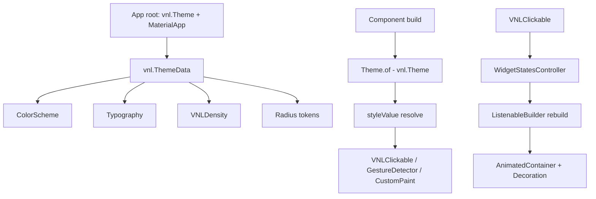

Task: @task-uunxmw
Spec: @doc/specs/migrate-material-core/migrate-vnl-to-material-core
Status: in-review

# 02 — Codebase Analysis

## Discovery Method & Scope

* **Method:** codetree_search + codetree_node + read file:line on critical paths.
  `rg` cho import pattern. `grep` cho class hierarchy. Manual trace từng component build method.
* **Swept:** `vnl_common_ui/lib/src/theme/` (toàn bộ), `lib/src/components/control/` (button, clickable, scrollbar, hover, command),
  `lib/src/components/form/` (toàn bộ 30 file), `lib/src/components/display/` (toàn bộ),
  `lib/src/components/layout/` (toàn bộ), `lib/src/components/navigation/` (toàn bộ),
  `lib/src/components/overlay/` (toàn bộ), `lib/src/components/locale/` (toàn bộ),
  `lib/src/components/menu/` (toàn bộ), `lib/shadcn_flutter.dart` (barrel)
* **Deliberately NOT swept:** `lib/src/components/chart/`, `lib/src/components/previewer/`,
  `lib/src/platform/`, `lib/fonts/`, `lib/l10n/`, `lib/icons/` — không chứa component, không liên quan migrate

## Affected Existing Components

| File | Component | Vai trò |
|------|-----------|--------|
| `lib/src/theme/theme.dart` | `ThemeData`, `Theme` | Shadow Material ThemeData — CỐT LÕI cần migrate |
| `lib/src/theme/color_scheme.dart` | `ColorScheme` | VNL color token — map sang Material |
| `lib/src/theme/typography.dart` | `Typography` | VNL text style token — map sang Material TextTheme |
| `lib/src/theme/density.dart` | `VNLDensity` | Spacing token — map sang Material VisualDensity |
| `lib/src/components/control/clickable.dart` (1207 dòng) | `VNLClickable`, `VNLStatedWidget`, `VNLWidgetStatesProvider` | Base interactive widget — CỐT LÕI, mọi button/chip/badge build trên này |
| `lib/src/components/control/button.dart` (6459 dòng) | `VNLButton`, `VNLButtonStyle`, `VNLButtonVariance`, `VNLAbstractButtonStyle`, 12 variant classes | Toàn bộ hệ thống button — backbone của design system |
| `lib/src/components/form/switch.dart` | `VNLSwitch` | Custom switch dùng AnimatedContainer |
| `lib/src/components/form/checkbox.dart` | `VNLCheckbox` | Custom checkbox + custom painter |
| `lib/src/components/form/multiple_choice.dart` | `VNLRadio`, `Choice<T>` | Custom radio group |
| `lib/src/components/form/slider.dart` (1419 dòng) | `VNLSlider` | Custom slider + range slider |
| `lib/src/components/form/text_field.dart` (3095 dòng) | `VNLTextField` | Dùng EditableText nội bộ, nhưng wrap 3000+ dòng custom |
| `lib/src/components/display/divider.dart` | `VNLDivider`, `VNLVerticalDivider` | CustomPaint divider |
| `lib/src/components/display/card.dart` | `VNLCard`, `VNLSurfaceCard` | Custom card |
| `lib/src/components/display/badge.dart` | `VNLPrimaryBadge`, `VNLSecondaryBadge`, `VNLOutlineBadge`, `VNLDestructiveBadge` | Badge build trên VNLButton |
| `lib/src/components/display/chip.dart` | `VNLChip`, `VNLChipButton` | Chip build trên VNLButton |
| `lib/src/components/display/avatar.dart` | `VNLAvatar`, `VNLAvatarGroup` | Custom avatar |
| `lib/src/components/display/circular_progress_indicator.dart` | `VNLCircularProgressIndicator` | ✅ ĐÃ dùng mat.CircularProgressIndicator — giữ nguyên |
| `lib/src/components/display/linear_progress_indicator.dart` | `VNLLinearProgressIndicator` | Custom |
| `lib/src/components/layout/scaffold.dart` | `VNLScaffold` | Custom scaffold |
| `lib/src/components/layout/dialog/alert_dialog.dart` | `VNLAlertDialog` | Custom dialog |
| `lib/src/components/overlay/dialog.dart` | `VNLModalBackdrop`, `VNLModalContainer`, `DialogRoute`, `showDialog` | Toàn bộ hệ thống dialog/overlay |
| `lib/src/components/overlay/tooltip.dart` | `VNLTooltip` | Custom tooltip |
| `lib/src/components/navigation/navigation_bar/` (8 file) | `VNLNavigationBar` (bar/rail/sidebar) | Custom navigation |
| `lib/src/components/navigation/tabs/` (4 file) | `VNLTabs` | Custom tabs |
| `lib/src/components/menu/` (6 file) | `VNLContextMenu`, `VNLDropdownMenu`, `VNLMenu*` | Custom menu system |
| `lib/shadcn_flutter.dart` | Barrel | Hide Flexible, Expanded, Row, Column, Flex, Stack, Positioned, Form, FormState, Table, TableRow, TableCell, FormField, RadioGroup |

## Current Behavior / Workflow (traced)

### Core: VNLClickable state + render pipeline

```
User tap → GestureDetector.onTap → _onPressed()
  → _updateState(WidgetState.pressed, true)
  → WidgetStatesController.update()
  → ListenableBuilder rebuilds
  → _builder() resolves decoration/mouseCursor/padding/textStyle/iconTheme/margin/transform
  → _buildContainer() tạo AnimatedContainer với resolved Decoration + Padding
  → VNLFocusOutline wrap outside
```

Evidence: `lib/src/components/control/clickable.dart:768-933`

### VNLButton builds on VNLClickable

```
VNLButton(style: VNLButtonStyle.primary(...), child: ..., onPressed: ...)
  → ButtonState.build()
  → VNLClickable(
      decoration: WidgetStateProperty.resolveWith(_resolveDecoration),
      mouseCursor: WidgetStateProperty.resolveWith(_resolveMouseCursor),
      padding: WidgetStateProperty.resolveWith(_resolvePadding),
      ...
      child: _buildAligned() // child content
    )
```

Evidence: `lib/src/components/control/button.dart:1474-1543`

### Theme resolution

```
Theme.of(context) → vnl.Theme (InheritedTheme)
  → vnl.ThemeData (colorScheme, typography, radius, scaling, density, ...)
Component build:
  final theme = Theme.of(context);
  final color = theme.colorScheme.primary;      // VNL ColorScheme
  final text = theme.typography.normal;          // VNL Typography
  final radius = theme.radiusMd;                 // VNL radius token
```

Evidence: `lib/src/theme/theme.dart:395-439` (Theme InheritedWidget), `theme.dart:148-392` (ThemeData)

### Component build pattern (điển hình: VNLSwitch)

```
VNLSwitch.build()
  → Theme.of(context) → VNL ThemeData
  → VNLComponentTheme.maybeOf<VNLSwitchTheme>(context)
  → styleValue() resolve widget/theme/default
  → return VNLFocusOutline(
      child: GestureDetector(
        onTap: () => onChanged(!value),
        child: FocusableActionDetector(
          actions: {ActivateIntent: ..., Space: ..., Enter: ...},
          child: Row([
            leading, SizedBox(gap),
            AnimatedContainer(           ← custom switch track
              decoration: BoxDecoration(...),
              child: Stack([
                AnimatedPositioned(       ← custom thumb
                  left: value ? 16 : 0,
                  child: Container(decoration: BoxDecoration(...)),
                ),
              ]),
            ),
            SizedBox(gap), trailing,
          ]),
        ),
      ),
    )
```

Evidence: `lib/src/components/form/switch.dart:361-475`

### Current Data Flow



## Worked Example (⛔ required)

**Given (real values):** User nhấn VNLButton.primary với child=Text("Save"), theme light.

**Path:**
1. `lib/src/components/control/button.dart:1474` — `ButtonState.build()` gọi VNLClickable với style resolve
2. `lib/src/components/control/clickable.dart:768` — `_ClickableState.build()` tạo VNLWidgetStatesProvider + ListenableBuilder
3. `lib/src/components/control/clickable.dart:800` — GestureDetector bọc FocusableActionDetector bọc AnimatedBuilder
4. `lib/src/components/control/clickable.dart:946` — `_buildContainer()` tạo AnimatedContainer với BoxDecoration từ VNLButtonVariance.primary
5. GestureDetector.onTap → `_onPressed()` → update WidgetState.pressed → ListenableBuilder rebuild → transform scale 0.95

**Result:** Button hiển thị với màu primary, padding từ VNLButtonVariance, animation scale khi press, focus outline khi focus.

**Why this matters:** Toàn bộ pipeline này cần map sang Material: VNLClickable → InkWell, VNLButtonVariance.primary → FilledButton.styleFrom(), WidgetStatesController → MaterialStateProperty.

**Verdict:** CONFIRMED — đã đọc toàn bộ call chain từ entry point đến render

## Blast Radius (⛔ required)

| # | Area / subsystem | Consequence when this changes | Sev | Crash? | Evidence |
|---|------------------|-------------------------------|-----|--------|----------|
| C1 | `lib/src/theme/theme.dart` — ThemeData, Theme | Ảnh hưởng TOÀN BỘ component gọi Theme.of(context) | CRIT | Yes | `Theme.of(context)` gọi trong ~100+ component |
| C2 | `lib/src/components/control/clickable.dart` — VNLClickable | Mọi interactive component: VNLButton, VNLChip, VNLBadge, VNLToggle, VNLSelectedButton... | CRIT | Yes | `lib/src/components/control/button.dart:1479` gọi VNLClickable; chip, badge gọi VNLButton |
| H1 | `lib/src/components/control/button.dart` — VNLButton, VNLButtonStyle, VNLButtonVariance | 12 button variants + mọi component build trên VNLButton (chip, badge, toggle, tab...) | HIGH | Yes | `button.dart` — 6459 dòng, dependency của ~30 component |
| H2 | `lib/src/components/form/switch.dart` — VNLSwitch | Form dùng VNLSwitch trong VNLForm | HIGH | No | `switch.dart:361` — dùng trong form system |
| H3 | `lib/src/components/form/slider.dart` — VNLSlider | Form dùng VNLSlider; VNLControlledSlider | HIGH | No | `slider.dart` — 1419 dòng |
| M1 | `lib/src/components/display/divider.dart` — VNLDivider | Dùng rộng rãi trong layout | MED | No | CustomPaint — nếu map sai thickness/color sẽ lệch visual |
| M2 | `lib/src/components/layout/scaffold.dart` — VNLScaffold | PageViewController base dùng VNLScaffold | MED | Yes | `scaffold.dart` — quan trọng trong base_app |
| M3 | `lib/src/components/navigation/` — NavigationBar, Tabs | Navigation trong base_app | MED | No | Material NavigationBar khác API với VNL navigation |
| L1 | `lib/src/components/display/badge.dart` — VNLBadge | Badge build trên VNLButton, tự resolve khi VNLButton migrate xong | LOW | No | Phụ thuộc VNLButton |
| L2 | `lib/src/components/display/chip.dart` — VNLChip | Chip build trên VNLButton, tự resolve khi VNLButton migrate xong | LOW | No | Phụ thuộc VNLButton |
| L3 | `lib/shadcn_flutter.dart` — hide directives | Bỏ hide → Material Row/Column/Flex quay lại, có thể conflict với VNL patched flex | LOW | No | Cần verify patched flex có conflict không |

### Systemic Root Causes

| # | Root cause (systemic) | Evidence | Symptoms it produces |
|---|-----------------------|----------|----------------------|
| R1 | `vnl.ThemeData` shadow `material.ThemeData` — `Theme.of(context)` trả về VNL type, không phải Material | `lib/src/theme/theme.dart:148`, `theme.dart:395` | → C1: mọi component không dùng được Material theme API |
| R2 | `VNLClickable` tự build toàn bộ state machine (WidgetStatesController + GestureDetector + FocusableActionDetector) thay vì dùng InkWell | `lib/src/components/control/clickable.dart:768-933` | → C2, H1: mọi interactive component phụ thuộc vào custom state system này |
| R3 | Barrel `hide` ngăn consumer dùng Material widget trực tiếp | `lib/shadcn_flutter.dart:24-42` | → L3: Material widget bị ẩn, consumer buộc dùng VNL |

### Checked — No Impact

| Area | Why it is safe | Evidence |
|------|----------------|----------|
| `lib/src/components/form/color_picker.dart` (124KB) | Không có Material equivalent — giữ nguyên | `color_picker.dart` — custom HSV/HSL picker |
| `lib/src/components/form/input_otp.dart` | Không có Material equivalent — giữ nguyên | `input_otp.dart` |
| `lib/src/components/form/star_rating.dart` | Không có Material equivalent — giữ nguyên | `star_rating.dart` |
| `lib/src/components/layout/window.dart` (104KB) | Desktop window chrome — giữ nguyên | `window.dart` |
| `lib/src/components/layout/sortable.dart` | Custom sortable layer — giữ nguyên | `sortable.dart` |
| `lib/src/components/layout/table.dart` (112KB) | VNLResizableTable — Material Table chưa stable — giữ nguyên | `table.dart` |
| `lib/src/components/form/form.dart` (103KB) | VNLForm system — giữ nguyên internal, chỉ map InputDecoration | `form.dart` |
| `lib/src/components/display/circular_progress_indicator.dart` | ĐÃ dùng mat.CircularProgressIndicator — không cần thay đổi | `circular_progress_indicator.dart:246` |
| `lib/src/components/locale/` | Đã dùng flutter_localizations + GlobalMaterialLocalizations — không cần thay đổi | `shadcn_localizations.dart:86-92` |
| `lib/fonts/` (Geist, GeistMono) | Font files — không liên quan | — |

## Standard / Contract Compliance

| Requirement (source) | Clause / rule | Current code | Compliant? |
|----------------------|---------------|--------------|------------|
| Flutter Material 3 spec | Widget nên extend/subclass Material widget | `lib/src/components/form/switch.dart:361` — dùng AnimatedContainer, không dùng Material Switch | ❌ |
| Flutter Material 3 spec | Theme nên dùng material.ThemeData | `lib/src/theme/theme.dart:148` — custom ThemeData shadow Material | ❌ |
| vr-mobile-flutter skill | "Always use package:vnl_common_ui/vnl_ui.dart, never package:flutter/material.dart directly" | Đúng — nhưng nội bộ vnl_common_ui cũng không dùng Material | ⚠️ Rule đúng cho consumer, nhưng library nên dùng Material |

## Parity Reference

N/A — đây không phải "behave like working Y". Đây là internal refactor: behavior giữ nguyên, chỉ đổi implementation.

## Patterns & Integration Points to Reuse

- `VNLCircularProgressIndicator` pattern: wrap `mat.CircularProgressIndicator` bên trong — dùng làm template cho các component khác
- `VNLookLocalizations` đã integrate `GlobalMaterialLocalizations.delegate` — pattern đúng, giữ nguyên
- `Data.inherit` / `Data.maybeOf` system — giữ nguyên, không liên quan Material migration
- `VNLComponentTheme` system — giữ nguyên, map sang Material theme data

## Constraints & Coupling

- **VNLClickable** là dependency cứng của VNLButton, VNLChip, VNLBadge, VNLToggle... → migrate VNLClickable trước
- **VNLButton** là dependency cứng của VNLChip, VNLBadge... → migrate VNLButton trước các component dùng nó
- **VNL ThemeData** là dependency cứng của TOÀN BỘ component → migrate theme trước tiên
- **Patched flex** (`lib/src/components/layout/flex.dart`) đang shadow Row, Column, Flex, Expanded... → cần verify không conflict khi bỏ hide
- **VNLForm system** (103KB) phụ thuộc vào VNLTextField, VNLSwitch, VNLCheckbox... → migrate form controls trước, form system giữ nguyên internal
