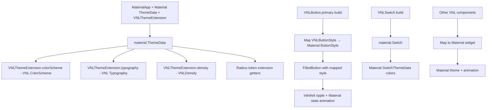

Task: @task-uunxmw
Spec: @doc/specs/migrate-material-core/migrate-vnl-to-material-core
Status: done

# 03 — Solution Analysis

## Goal — What needs to be done?

* Goal 1 — Theme unification: Xóa `vnl.ThemeData` + `vnl.Theme`, thay bằng `material.ThemeData` + `VNLThemeExtension`. VNL ColorScheme + Typography giữ nguyên property name, map nội bộ sang Material.
* Goal 2 — Core interactive: `VNLClickable` wrap `InkWell`, `VNLButton` wrap Material buttons (FilledButton, FilledTonalButton, OutlinedButton, TextButton). Xóa custom state machine.
* Goal 3 — Component migration: Từng VNL component wrap Material widget tương ứng bên trong. API public không đổi.
* Goal 4 — Barrel cleanup: Xóa `hide` directives, Material widget có sẵn cho consumer.
* Goal 5 — Zero regression: vnl_ui_docs chạy không visual thay đổi.

## Approach — How is it done?

### Technical

**Theme layer (Phase 1):**

```
Trước:                                   Sau:
Theme.of(context) → vnl.ThemeData        Theme.of(context) → material.ThemeData
  .colorScheme → VNL ColorScheme           .extension<VNLThemeExtension>()!.colorScheme → VNL ColorScheme (giữ nguyên tên)
  .typography → VNL Typography             .extension<VNLThemeExtension>()!.typography → VNL Typography (giữ nguyên tên)
  .radiusMd → double (từ VNL)             .vnlRadiusMd → double (extension getter trên material.ThemeData)
```

Cơ chế:
- `VNLThemeExtension extends ThemeExtension<VNLThemeExtension>` — chứa `ColorScheme`, `Typography`, `scaling`, `surfaceOpacity`, `surfaceBlur`, `VNLDensity`
- Extension method trên `material.ColorScheme` để map: `vnlColorScheme.background` → internal `materialColorScheme.surface`
- Extension method trên `material.TextTheme` để map: `vnlTypography.h1` → internal `materialTextTheme.displayLarge`
- Extension getter trên `material.ThemeData`: `radiusMd`, `borderRadiusMd`, `radiusLg`... tính từ `material.ThemeData` properties
- App root: `MaterialApp(theme: materialThemeData.copyWith(extensions: [VNLThemeExtension(...)]))`

**VNLClickable → InkWell (Phase 2):**

```dart
// Trước: GestureDetector + FocusableActionDetector + AnimatedContainer
// Sau: InkWell + Container

class VNLClickable extends StatelessWidget {
  @override
  Widget build(BuildContext context) {
    return InkWell(
      onTap: onPressed,
      onHover: onHover != null ? (v) => onHover!(v) : null,
      onFocusChange: onFocus != null ? (v) => onFocus!(v) : null,
      focusNode: focusNode,
      mouseCursor: mouseCursor?.resolve(states) ?? MouseCursor.defer,
      enableFeedback: enableFeedback,
      // decoration → Ink's decoration
      // padding/textStyle/iconTheme → wrap bên ngoài
      child: _applyWrappers(child),
    );
  }
}
```

State management: xóa `WidgetStatesController` tự build, dùng `MaterialStateProperty` của Material (đã có trong InkWell).

**VNLButton → Material buttons (Phase 2):**

```dart
// VNLButtonVariance.primary → FilledButton
// VNLButtonVariance.secondary → FilledTonalButton
// VNLButtonVariance.outline → OutlinedButton
// VNLButtonVariance.ghost → TextButton (no background)
// VNLButtonVariance.link → TextButton (underline)
// VNLButtonVariance.destructive → FilledButton(error color)

class VNLButton extends StatelessWidget {
  @override
  Widget build(BuildContext context) {
    final materialStyle = _style.toMaterialButtonStyle(context);
    return switch (_style.variance.type) {
      VNLButtonVarianceType.primary => FilledButton(
        style: materialStyle,
        onPressed: onPressed,
        child: _buildChild(),
      ),
      VNLButtonVarianceType.outline => OutlinedButton(
        style: materialStyle,
        onPressed: onPressed,
        child: _buildChild(),
      ),
      // ...
    };
  }
}
```

**Component wrap (Phase 3-4):**

Mỗi component giữ nguyên VNL class + constructor. Build method thay internal implementation:

```dart
// VNLSwitch → material.Switch
class VNLSwitch extends StatelessWidget {
  @override
  Widget build(BuildContext context) {
    return Row(children: [
      if (leading != null) leading!,
      Switch(value: value, onChanged: onChanged, ...),
      if (trailing != null) trailing!,
    ]);
  }
}
```

### Data

Không thay đổi data model. Chỉ thay đổi cách build UI. VNL model class (ColorScheme, Typography, VNLDensity) giữ nguyên — thêm extension method map sang Material.

### Workflow

```
1. Phase 1: Theme map → Material ThemeData + VNLThemeExtension hoạt động
   → Mọi component vẫn compile với Theme.of(context) (material.ThemeData)
   → VNL token access qua extension
2. Phase 2: VNLClickable → InkWell → VNLButton → Material buttons
   → Tất cả interactive component compile + chạy
3. Phase 3-4: Từng component migrate → Material widget bên trong
4. Phase 5: Cleanup dead code, xóa hide, verify toàn bộ
```

### New Design

Không có UI mới. Đây là internal refactor — visual output giữ nguyên. Ripple effect của InkWell là visual change duy nhất (đã accept).

### Target Data Flow



## Alternatives & Choice (⛔ required)

| # | Direction | Trade-off | Chosen? + why |
|---|-----------|-----------|---------------|
| 1 | **Material widget làm core, VNL wrap mỏng** (phương án này) | Ít custom code nhất, được hưởng update + fix từ Flutter team. Rủi ro: visual drift nếu Material theme map không khớp 100% | ✅ Chọn — user yêu cầu rõ "base material, shadcn style" |
| 2 | Giữ nguyên custom, chỉ thêm Material theme interop | Không đụng gì, an toàn nhất. Nhưng vẫn là UI kit độc lập, không phải design system base Material | ❌ Không đáp ứng yêu cầu "material làm core" |
| 3 | Viết lại từ đầu dùng Material trực tiếp | Sạch nhất về lâu dài. Nhưng mất toàn bộ API hiện tại, base_app phải migrate | ❌ Quá rủi ro, user yêu cầu "cover đầy đủ tránh thay đổi UI" |

## Roadmap (⛔ required)

| Phase | Observable goal | Files/symbols touched | Depends on | Verify how | Rollback |
|-------|-----------------|----------------------|------------|-----------|----------|
| 1 | Theme map: Theme.of(context) → material.ThemeData; VNL color/type token vẫn access được | `theme/color_scheme.dart`, `theme/typography.dart`, `theme/density.dart`, `theme/theme.dart`, `shadcn_flutter.dart` | — | Compile + runtime test Theme access | Revert commit |
| 2 | VNLClickable wrap InkWell; VNLButton wrap Material buttons; all button variants visual match | `control/clickable.dart`, `control/button.dart` | Phase 1 | Screenshot diff từng button variant + state | Revert commit |
| 3 | Form controls wrap Material: Switch, Checkbox, Radio, Slider, TextField, DatePicker, Tooltip, Chip, Badge, Progress | `form/switch.dart`, `form/checkbox.dart`, `form/multiple_choice.dart`, `form/slider.dart`, `form/text_field.dart`, `display/chip.dart`, `display/badge.dart`, `overlay/tooltip.dart` | Phase 2 | Screenshot diff từng form control | Revert commit |
| 4 | Layout/Nav/Overlay wrap Material: Divider, Card, Scaffold, NavBar, Tabs, Dialog, Dropdown, Stepper, Accordion | `display/divider.dart`, `layout/card.dart`, `layout/scaffold.dart`, `navigation/*`, `overlay/dialog.dart`, `menu/*` | Phase 3 | Screenshot diff layout + nav | Revert commit |
| 5 | Cleanup dead code, xóa hide directives, full regression verify | `shadcn_flutter.dart` + toàn bộ file migrated | Phase 4 | Full vnl_ui_docs screenshot regression + accessibility test | Revert commit |

## Impacts & Risks

* **Affected Scope:** ~180 component trong `lib/src/components/`, theme system, barrel file. Consumer không bị ảnh hưởng API.
* **Effect on existing code:** Mọi component build method thay đổi internal — nhưng visual output giữ nguyên.
* **Potential Risks:**
  - Material theme color map không khớp 100% → visual drift (mitigate: test screenshot từng component)
  - Material widget behavior khác VNL (animation timing, padding mặc định) → visual drift (mitigate: dùng styleFrom override mọi property)
  - Ripple effect của InkWell thay đổi animation → đã accept
  - Patched flex (Row, Column, Flex) conflict khi bỏ hide → verify trước khi bỏ hide

### Blast-Radius Disposition

| `02` ID | Sev | Disposition | Where handled |
|---------|-----|-------------|---------------|
| C1 | CRIT | Mitigate — map toàn bộ VNL theme token sang Material | Phase 1 |
| C2 | CRIT | Mitigate — VNLClickable wrap InkWell, verify mọi interactive component | Phase 2 |
| H1 | HIGH | Mitigate — VNLButton map sang Material buttons, verify 12 variant | Phase 2 |
| H2 | HIGH | Mitigate — VNLSwitch wrap material.Switch | Phase 3 |
| H3 | HIGH | Mitigate — VNLSlider wrap material.Slider/RangeSlider | Phase 3 |
| M1 | MED | Mitigate — VNLDivider wrap material.Divider | Phase 4 |
| M2 | MED | Mitigate — VNLScaffold wrap material.Scaffold | Phase 4 |
| M3 | MED | Mitigate — NavigationBar/Tabs wrap Material | Phase 4 |
| L1 | LOW | Accept — tự resolve khi VNLButton migrate xong (Phase 2) | Phase 2 |
| L2 | LOW | Accept — tự resolve khi VNLButton migrate xong (Phase 2) | Phase 2 |
| L3 | LOW | Mitigate — verify patched flex không conflict với Material | Phase 5 |

## Open Questions

| # | Question | Why it blocks | Resolution | Resolved by | Date |
|---|----------|---------------|------------|-------------|------|
| — | None | — | — | — | — |

## Decisions & Corrections

| # | Final decision | Decided by + date | Supersedes / corrects |
|---|----------------|-------------------|-----------------------|
| 1 | Dùng InkWell với ripple effect (không giữ animation scale 0.95 cũ) | User + 2026-07-25 | — |
| 2 | Component không có Material equivalent giữ nguyên custom | User + 2026-07-25 | — |
| 3 | File-by-file fill spec (không one-pass) | User + 2026-07-25 | — |
