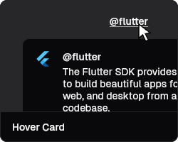

# VNL Common UI Components Guide

> **Note:** These UI components are designed following Shadcn UI principles. If a component name with the VNL prefix matches a Material 3 widget, always prefer using the VNL version for consistency and design alignment.
> 
> This is the official documentation for all VNL Common UI components. Do not confuse these with Material 3 widgets.

## Table of Contents

- [VNLookApp](#vnlookapp)
- [VNLookLayer](#vnlooklayer)
- [VNLookAnimatedTheme](#vnlookanimatedtheme)
- [VNLookUI](#vnlookui)
- [AdaptiveScaler](#adaptivescaler)
- [Scrollbar](#scrollbar)
- [ScrollViewInterceptor](#scrollviewinterceptor)
- [CommandEmpty](#commandempty)
- [VNLCommand](#vnlcommand)
- [CommandCategory](#commandcategory)
- [CommandItem](#commanditem)
- [AnimatedValueBuilder](#animatedvaluebuilder)
- [RepeatedAnimationBuilder](#repeatedanimationbuilder)
- [CrossFadedTransition](#crossfadedtransition)
- [VNLRefreshTrigger](#vnlrefreshtrigger)
- [DefaultRefreshIndicator](#defaultrefreshindicator)
- [VNLSelectableText](#vnlselectabletext)
- [ToastLayer](#toastlayer)
- [ToastEntryLayout](#toastentrylayout)
- [ControlledToggle](#controlledtoggle)
- [VNLToggle](#vnltoggle)
- [SelectedButton](#selectedbutton)
- [VNLButton](#vnlbutton)
- [PrimaryButton](#primarybutton)
- [SecondaryButton](#secondarybutton)
- [OutlineButton](#outlinebutton)
- [GhostButton](#ghostbutton)
- [LinkButton](#linkbutton)
- [TextButton](#textbutton)
- [DestructiveButton](#destructivebutton)
- [TabButton](#tabbutton)
- [CardButton](#cardbutton)
- [IconButton](#iconbutton)
- [ButtonStyleOverride](#buttonstyleoverride)
- [ButtonGroup](#buttongroup)
- [CodeSnippet](#codesnippet)
- [VNLDropdownMenu](#vnldropdownmenu)
- [AvatarWidget](#avatarwidget)
- [Avatar](#avatar)
- [AvatarBadge](#avatarbadge)
- [_AvatarWidget](#_avatarwidget)
- [AvatarGroup](#avatargroup)
- [AvatarGroupClipper](#avatargroupclipper)
- [ModalBackdrop](#modalbackdrop)
- [ModalContainer](#modalcontainer)
- [VNLDivider](#vnldivider)
- [VerticalDivider](#verticaldivider)
- [CircularProgressIndicator](#circularprogressindicator)
- [Spinner](#spinner)
- [ChipButton](#chipbutton)
- [VNLChip](#vnlchip)
- [VNLDotIndicator](#vnldotindicator)
- [DotItem](#dotitem)
- [ActiveDotItem](#activedotitem)
- [InactiveDotItem](#inactivedotitem)
- [KeyboardShortcutDisplayMapper](#keyboardshortcutdisplaymapper)
- [VNLKeyboardDisplay](#vnlkeyboarddisplay)
- [KeyboardKeyDisplay](#keyboardkeydisplay)
- [VNLProgress](#vnlprogress)
- [VNLookSkeletonizerConfigLayer](#vnlookskeletonizerconfiglayer)
- [VNLCarousel](#vnlcarousel)
- [_CarouselState](#_carouselstate)
- [CarouselDotIndicator](#carouseldotindicator)
- [NumberTicker](#numberticker)
- [LinearProgressIndicator](#linearprogressindicator)
- [PrimaryBadge](#primarybadge)
- [SecondaryBadge](#secondarybadge)
- [OutlineBadge](#outlinebadge)
- [DestructiveBadge](#destructivebadge)
- [FadeScroll](#fadescroll)
- [MenuPopup](#menupopup)
- [DesktopEditableTextContextMenu](#desktopeditabletextcontextmenu)
- [MobileEditableTextContextMenu](#mobileeditabletextcontextmenu)
- [VNLContextMenu](#vnlcontextmenu)
- [ContextMenuPopup](#contextmenupopup)
- [VNLTextModifier](#vnltextmodifier)
- [_TextThenWidget](#_textthenwidget)
- [_RichTextThenWidget](#_richtextthenwidget)
- [_SelectableTextThenWidget](#_selectabletextthenwidget)
- [VNLWrappedText](#vnlwrappedtext)
- [VNLTextModifierImpl](#vnltextmodifierimpl)
- [DatePickerDialog](#datepickerdialog)
- [VNLCalendar](#vnlcalendar)
- [MonthCalendar](#monthcalendar)
- [YearCalendar](#yearcalendar)
- [CalendarItem](#calendaritem)
- [CalendarGrid](#calendargrid)
- [VNLMenubar](#vnlmenubar)
- [HoverActivity](#hoveractivity)
- [Hover](#hover)
- [StatedWidget](#statedwidget)
- [WidgetStatesProvider](#widgetstatesprovider)
- [Clickable](#clickable)

---

<!-- AUTO-GENERATED COMPONENT SECTIONS BELOW -->

## Button


- **Name:** `PrimaryButton`, `SecondaryButton`, `OutlineButton`, ...
- **Description:** Various customizable button types, supporting multiple styles, states, and icons.
- **Usage:**
```dart
PrimaryButton(
  onPressed: () {},
  child: Text('Primary'),
)
```
- **Note:** Do not confuse with `ElevatedButton`, `TextButton` from Material 3. These buttons have their own style and behavior in VNL.

---

## Accordion


- **Name:** `Accordion`, `AccordionItem`, `AccordionTrigger`
- **Description:** Accordion allows expanding/collapsing content.
- **Usage:**
```dart
Accordion(
  children: [
    AccordionItem(
      title: Text('Title'),
      content: Text('Content'),
    ),
  ],
)
```
- **Note:** Do not confuse with ExpansionPanel from Material.

---

## AlertDialog


- **Name:** `AlertDialog`
- **Description:** Alert dialog, confirmation dialog, customizable interface.
- **Usage:**
```dart
showDialog(
  context: context,
  builder: (context) => AlertDialog(
    title: Text('Alert'),
    content: Text('Are you sure?'),
    actions: [
      PrimaryButton(child: Text('OK'), onPressed: () {}),
    ],
  ),
);
```
- **Note:** Do not confuse with `showDialog`/`AlertDialog` from Material.

---

## Avatar


- **Name:** `Avatar`, `AvatarGroup`
- **Description:** Displays user avatar, group avatar.
- **Usage:**
```dart
Avatar(
  image: NetworkImage('https://...'),
  size: 40,
)
```
- **Note:** Do not confuse with CircleAvatar from Material.

---

## Badge


- **Name:** `PrimaryBadge`, `SecondaryBadge`, ...
- **Description:** Displays status badge, quantity, ...
- **Usage:**
```dart
PrimaryBadge(
  label: 'New',
)
```
- **Note:** Do not confuse with Badge from Material 3.

---

## VNLookApp
_No image available._

**Description:** Root widget for VNL UI applications, providing theming and configuration.

**Usage:**
```dart
VNLookApp(
  child: MyHomePage(),
)
```
**Note:** Do not confuse with MaterialApp from Material 3.

---

## VNLookLayer
_No image available._

**Description:** Provides a layer for advanced UI composition in VNL UI.

**Usage:**
```dart
VNLookLayer(
  child: ...,
)
```
**Note:** Not a Material 3 widget.

---

## VNLookAnimatedTheme
_No image available._

**Description:** Animated theme transitions for VNL UI.

**Usage:**
```dart
VNLookAnimatedTheme(
  data: themeData,
  child: ...,
)
```
**Note:** Not a Material 3 widget.

---

## VNLookUI
_No image available._

**Description:** Main entry point for VNL UI widgets.

**Usage:**
```dart
VNLookUI(
  child: ...,
)
```
**Note:** Not a Material 3 widget.

---

## AdaptiveScaler
_No image available._

**Description:** Widget for responsive scaling in VNL UI.

**Usage:**
```dart
AdaptiveScaler(
  child: ...,
)
```
**Note:** Not a Material 3 widget.

---

## Scrollbar
_No image available._

**Description:** Custom scrollbar for VNL UI scrollable widgets.

**Usage:**
```dart
Scrollbar(
  child: ListView(...),
)
```
**Note:** Do not confuse with Scrollbar from Material 3.

---

## ScrollViewInterceptor
_No image available._

**Description:** Intercepts scroll events for advanced scroll handling.

**Usage:**
```dart
ScrollViewInterceptor(
  child: ...,
)
```
**Note:** Not a Material 3 widget.

---

## CommandEmpty


**Description:** An empty command widget for command palette or menu.

**Usage:**
```dart
CommandEmpty()
```
**Note:** Not a Material 3 widget.

---

## VNLCommand


**Description:** Command widget for command palette or menu.

**Usage:**
```dart
VNLCommand(
  label: 'Command',
  onPressed: () {},
)
```
**Note:** Not a Material 3 widget.

---

## CommandCategory


**Description:** Category grouping for commands in a palette or menu.

**Usage:**
```dart
CommandCategory(
  label: 'Category',
  children: [...],
)
```
**Note:** Not a Material 3 widget.

---

## CommandItem


**Description:** Represents a single command item in a palette or menu.

**Usage:**
```dart
CommandItem(
  label: 'Item',
  onPressed: () {},
)
```
**Note:** Not a Material 3 widget.

---

## AnimatedValueBuilder


**Description:** Widget for building animated values over time.

**Usage:**
```dart
AnimatedValueBuilder(
  value: ...,
  builder: (context, value, child) => ...,
)
```
**Note:** Not a Material 3 widget.

---

## RepeatedAnimationBuilder


**Description:** Widget for building repeated animations.

**Usage:**
```dart
RepeatedAnimationBuilder(
  ...
)
```
**Note:** Not a Material 3 widget.

---

## CrossFadedTransition
_No image available._

**Description:** Widget for cross-fading between two children.

**Usage:**
```dart
CrossFadedTransition(
  firstChild: ...,
  secondChild: ...,
  showFirst: true,
)
```
**Note:** Not a Material 3 widget.

---

## VNLRefreshTrigger


**Description:** Widget to trigger refresh actions in lists or forms.

**Usage:**
```dart
VNLRefreshTrigger(
  onRefresh: () async { ... },
  child: ...,
)
```
**Note:** Not a Material 3 widget.

---

## DefaultRefreshIndicator


**Description:** Default refresh indicator for pull-to-refresh actions.

**Usage:**
```dart
DefaultRefreshIndicator(
  onRefresh: () async { ... },
  child: ...,
)
```
**Note:** Not a Material 3 widget.

---

## VNLSelectableText


**Description:** Selectable text widget for VNL UI.

**Usage:**
```dart
VNLSelectableText('Selectable text')
```
**Note:** Do not confuse with SelectableText from Material 3.

---

## ToastLayer


**Description:** Layer for displaying toast notifications.

**Usage:**
```dart
ToastLayer(
  child: ...,
)
```
**Note:** Not a Material 3 widget.

---

## ToastEntryLayout


**Description:** Layout for individual toast entries.

**Usage:**
```dart
ToastEntryLayout(
  ...
)
```
**Note:** Not a Material 3 widget.

---

## ControlledToggle


**Description:** Controlled toggle switch widget.

**Usage:**
```dart
ControlledToggle(
  value: true,
  onChanged: (val) {},
)
```
**Note:** Do not confuse with Switch from Material 3.

---

## VNLToggle


**Description:** Toggle switch widget for VNL UI.

**Usage:**
```dart
VNLToggle(
  value: true,
  onChanged: (val) {},
)
```
**Note:** Do not confuse with Switch from Material 3.

---

## SelectedButton


**Description:** Button widget with selected state.

**Usage:**
```dart
SelectedButton(
  selected: true,
  child: Text('Selected'),
)
```
**Note:** Not a Material 3 widget.

---

## VNLButton


**Description:** Base button widget for VNL UI.

**Usage:**
```dart
VNLButton(
  onPressed: () {},
  child: Text('Button'),
)
```
**Note:** Do not confuse with ElevatedButton from Material 3.

---

## PrimaryButton


**Description:** Primary action button for VNL UI.

**Usage:**
```dart
PrimaryButton(
  onPressed: () {},
  child: Text('Primary'),
)
```
**Note:** Do not confuse with ElevatedButton from Material 3.

---

## SecondaryButton


**Description:** Secondary action button for VNL UI.

**Usage:**
```dart
SecondaryButton(
  onPressed: () {},
  child: Text('Secondary'),
)
```
**Note:** Do not confuse with OutlinedButton from Material 3.

---

## OutlineButton


**Description:** Outline style button for VNL UI.

**Usage:**
```dart
OutlineButton(
  onPressed: () {},
  child: Text('Outline'),
)
```
**Note:** Do not confuse with OutlinedButton from Material 3.

---

## GhostButton


**Description:** Ghost style button for VNL UI.

**Usage:**
```dart
GhostButton(
  onPressed: () {},
  child: Text('Ghost'),
)
```
**Note:** Not a Material 3 widget.

---

## LinkButton


**Description:** Link style button for VNL UI.

**Usage:**
```dart
LinkButton(
  onPressed: () {},
  child: Text('Link'),
)
```
**Note:** Not a Material 3 widget.

---

## TextButton


**Description:** Text style button for VNL UI.

**Usage:**
```dart
TextButton(
  onPressed: () {},
  child: Text('Text'),
)
```
**Note:** Do not confuse with TextButton from Material 3.

---

## DestructiveButton


**Description:** Destructive action button for VNL UI.

**Usage:**
```dart
DestructiveButton(
  onPressed: () {},
  child: Text('Delete'),
)
```
**Note:** Not a Material 3 widget.

---

## TabButton


**Description:** Tab style button for VNL UI.

**Usage:**
```dart
TabButton(
  onPressed: () {},
  child: Text('Tab'),
)
```
**Note:** Not a Material 3 widget.

---

## CardButton


**Description:** Card style button for VNL UI.

**Usage:**
```dart
CardButton(
  onPressed: () {},
  child: Text('Card'),
)
```
**Note:** Not a Material 3 widget.

---

## IconButton


**Description:** Icon button for VNL UI.

**Usage:**
```dart
IconButton(
  icon: Icon(Icons.star),
  onPressed: () {},
)
```
**Note:** Do not confuse with IconButton from Material 3.

---

## ButtonStyleOverride


**Description:** Widget to override button styles in VNL UI.

**Usage:**
```dart
ButtonStyleOverride(
  style: ..., 
  child: ...,
)
```
**Note:** Not a Material 3 widget.

---

## ButtonGroup


**Description:** Group of buttons for VNL UI.

**Usage:**
```dart
ButtonGroup(
  children: [...],
)
```
**Note:** Not a Material 3 widget.

---

## CodeSnippet


**Description:** Widget to display code snippets with formatting.

**Usage:**
```dart
CodeSnippet(
  code: 'print("Hello World")',
)
```
**Note:** Not a Material 3 widget.

---

## VNLDropdownMenu


**Description:** Dropdown menu for VNL UI.

**Usage:**
```dart
VNLDropdownMenu(
  items: [...],
)
```
**Note:** Do not confuse with DropdownButton from Material 3.

---

## AvatarWidget


**Description:** Base widget for avatar display in VNL UI.

**Usage:**
```dart
AvatarWidget(
  ...
)
```
**Note:** Do not confuse with CircleAvatar from Material 3.

---

## Avatar


**Description:** Widget to display a user avatar.

**Usage:**
```dart
Avatar(
  image: NetworkImage('https://...'),
  size: 40,
)
```
**Note:** Do not confuse with CircleAvatar from Material 3.

---

## AvatarBadge


**Description:** Badge for avatar widget.

**Usage:**
```dart
AvatarBadge(
  ...
)
```
**Note:** Not a Material 3 widget.

---

## _AvatarWidget


**Description:** Internal avatar widget for VNL UI.

**Usage:**
```dart
_AvatarWidget(
  ...
)
```
**Note:** Not a Material 3 widget.

---

## AvatarGroup


**Description:** Widget to display a group of avatars.

**Usage:**
```dart
AvatarGroup(
  avatars: [...],
)
```
**Note:** Not a Material 3 widget.

---

## AvatarGroupClipper
_No image available._

**Description:** Clipper for avatar group widget.

**Usage:**
```dart
AvatarGroupClipper(
  ...
)
```
**Note:** Not a Material 3 widget.

---

## ModalBackdrop


**Description:** Backdrop for modal dialogs.

**Usage:**
```dart
ModalBackdrop(
  child: ...,
)
```
**Note:** Not a Material 3 widget.

---

## ModalContainer


**Description:** Container for modal dialogs.

**Usage:**
```dart
ModalContainer(
  child: ...,
)
```
**Note:** Not a Material 3 widget.

---

## VNLDivider


**Description:** Divider widget for VNL UI.

**Usage:**
```dart
VNLDivider()
```
**Note:** Do not confuse with Divider from Material 3.

---

## VerticalDivider


**Description:** Vertical divider widget for VNL UI.

**Usage:**
```dart
VerticalDivider()
```
**Note:** Do not confuse with VerticalDivider from Material 3.

---

## CircularProgressIndicator


**Description:** Circular progress indicator for VNL UI.

**Usage:**
```dart
CircularProgressIndicator()
```
**Note:** Do not confuse with CircularProgressIndicator from Material 3.

---

## Spinner


**Description:** Spinner widget for loading states.

**Usage:**
```dart
Spinner()
```
**Note:** Not a Material 3 widget.

---

## ChipButton


**Description:** Button styled as a chip.

**Usage:**
```dart
ChipButton(
  label: 'Chip',
)
```
**Note:** Not a Material 3 widget.

---

## VNLChip


**Description:** Chip widget for VNL UI.

**Usage:**
```dart
VNLChip(
  label: 'Chip',
)
```
**Note:** Do not confuse with Chip from Material 3.

---

## VNLDotIndicator


**Description:** Dot indicator widget for VNL UI.

**Usage:**
```dart
VNLDotIndicator(
  ...
)
```
**Note:** Not a Material 3 widget.

---

## DotItem


**Description:** Single dot item for dot indicators.

**Usage:**
```dart
DotItem()
```
**Note:** Not a Material 3 widget.

---

## ActiveDotItem


**Description:** Active state dot item for dot indicators.

**Usage:**
```dart
ActiveDotItem()
```
**Note:** Not a Material 3 widget.

---

## InactiveDotItem


**Description:** Inactive state dot item for dot indicators.

**Usage:**
```dart
InactiveDotItem()
```
**Note:** Not a Material 3 widget.

---

## KeyboardShortcutDisplayMapper
_No image available._

**Description:** Widget to map and display keyboard shortcuts.

**Usage:**
```dart
KeyboardShortcutDisplayMapper(
  ...
)
```
**Note:** Not a Material 3 widget.

---

## VNLKeyboardDisplay
_No image available._

**Description:** Widget to display a keyboard layout.

**Usage:**
```dart
VNLKeyboardDisplay(
  ...
)
```
**Note:** Not a Material 3 widget.

---

## KeyboardKeyDisplay
_No image available._

**Description:** Widget to display a single keyboard key.

**Usage:**
```dart
KeyboardKeyDisplay(
  ...
)
```
**Note:** Not a Material 3 widget.

---

## VNLProgress


**Description:** Progress bar widget for VNL UI.

**Usage:**
```dart
VNLProgress(
  value: 0.5,
)
```
**Note:** Do not confuse with LinearProgressIndicator from Material 3.

---

## VNLookSkeletonizerConfigLayer


**Description:** Skeleton loading layer for VNL UI.

**Usage:**
```dart
VNLookSkeletonizerConfigLayer(
  child: ...,
)
```
**Note:** Not a Material 3 widget.

---

## VNLCarousel


**Description:** Carousel widget for VNL UI.

**Usage:**
```dart
VNLCarousel(
  items: [...],
)
```
**Note:** Not a Material 3 widget.

---

## _CarouselState


**Description:** Internal state for carousel widget.

**Usage:**
```dart
_CarouselState()
```
**Note:** Not a Material 3 widget.

---

## CarouselDotIndicator


**Description:** Dot indicator for carousel widget.

**Usage:**
```dart
CarouselDotIndicator(
  ...
)
```
**Note:** Not a Material 3 widget.

---

## NumberTicker


**Description:** Animated number ticker widget.

**Usage:**
```dart
NumberTicker(
  value: 100,
)
```
**Note:** Not a Material 3 widget.

---

## LinearProgressIndicator


**Description:** Linear progress indicator for VNL UI.

**Usage:**
```dart
LinearProgressIndicator(
  value: 0.5,
)
```
**Note:** Do not confuse with LinearProgressIndicator from Material 3.

---

## PrimaryBadge


**Description:** Primary badge widget for VNL UI.

**Usage:**
```dart
PrimaryBadge(
  label: 'New',
)
```
**Note:** Not a Material 3 widget.

---

## SecondaryBadge


**Description:** Secondary badge widget for VNL UI.

**Usage:**
```dart
SecondaryBadge(
  label: 'Info',
)
```
**Note:** Not a Material 3 widget.

---

## OutlineBadge


**Description:** Outline badge widget for VNL UI.

**Usage:**
```dart
OutlineBadge(
  label: 'Outline',
)
```
**Note:** Not a Material 3 widget.

---

## DestructiveBadge


**Description:** Destructive badge widget for VNL UI.

**Usage:**
```dart
DestructiveBadge(
  label: 'Delete',
)
```
**Note:** Not a Material 3 widget.

---

## FadeScroll


**Description:** Widget for fading scroll effects.

**Usage:**
```dart
FadeScroll(
  child: ...,
)
```
**Note:** Not a Material 3 widget.

---

## MenuPopup


**Description:** Popup menu widget for VNL UI.

**Usage:**
```dart
MenuPopup(
  items: [...],
)
```
**Note:** Not a Material 3 widget.

---

## DesktopEditableTextContextMenu


**Description:** Desktop context menu for editable text fields.

**Usage:**
```dart
DesktopEditableTextContextMenu(
  ...
)
```
**Note:** Not a Material 3 widget.

---

## MobileEditableTextContextMenu


**Description:** Mobile context menu for editable text fields.

**Usage:**
```dart
MobileEditableTextContextMenu(
  ...
)
```
**Note:** Not a Material 3 widget.

---

## VNLContextMenu


**Description:** Context menu widget for VNL UI.

**Usage:**
```dart
VNLContextMenu(
  items: [...],
)
```
**Note:** Not a Material 3 widget.

---

## ContextMenuPopup


**Description:** Popup for context menu widget.

**Usage:**
```dart
ContextMenuPopup(
  ...
)
```
**Note:** Not a Material 3 widget.

---

## VNLTextModifier
_No image available._

**Description:** Widget to modify text display in VNL UI.

**Usage:**
```dart
VNLTextModifier(
  ...
)
```
**Note:** Not a Material 3 widget.

---

## _TextThenWidget
_No image available._

**Description:** Internal widget for text display.

**Usage:**
```dart
_TextThenWidget(
  ...
)
```
**Note:** Not a Material 3 widget.

---

## _RichTextThenWidget
_No image available._

**Description:** Internal widget for rich text display.

**Usage:**
```dart
_RichTextThenWidget(
  ...
)
```
**Note:** Not a Material 3 widget.

---

## _SelectableTextThenWidget
_No image available._

**Description:** Internal widget for selectable text display.

**Usage:**
```dart
_SelectableTextThenWidget(
  ...
)
```
**Note:** Not a Material 3 widget.

---

## VNLWrappedText
_No image available._

**Description:** Widget for wrapped text display in VNL UI.

**Usage:**
```dart
VNLWrappedText(
  ...
)
```
**Note:** Not a Material 3 widget.

---

## VNLTextModifierImpl
_No image available._

**Description:** Implementation of text modifier for VNL UI.

**Usage:**
```dart
VNLTextModifierImpl(
  ...
)
```
**Note:** Not a Material 3 widget.

---

## DatePickerDialog


**Description:** Date picker dialog for VNL UI.

**Usage:**
```dart
DatePickerDialog(
  ...
)
```
**Note:** Do not confuse with showDatePicker from Material 3.

---

## VNLCalendar


**Description:** Calendar widget for VNL UI.

**Usage:**
```dart
VNLCalendar(
  ...
)
```
**Note:** Do not confuse with CalendarDatePicker from Material 3.

---

## MonthCalendar


**Description:** Month view calendar widget.

**Usage:**
```dart
MonthCalendar(
  ...
)
```
**Note:** Not a Material 3 widget.

---

## YearCalendar


**Description:** Year view calendar widget.

**Usage:**
```dart
YearCalendar(
  ...
)
```
**Note:** Not a Material 3 widget.

---

## CalendarItem


**Description:** Single item in a calendar view.

**Usage:**
```dart
CalendarItem(
  ...
)
```
**Note:** Not a Material 3 widget.

---

## CalendarGrid


**Description:** Grid layout for calendar widget.

**Usage:**
```dart
CalendarGrid(
  ...
)
```
**Note:** Not a Material 3 widget.

---

## VNLMenubar


**Description:** Menubar widget for VNL UI.

**Usage:**
```dart
VNLMenubar(
  ...
)
```
**Note:** Not a Material 3 widget.

---

## HoverActivity


**Description:** Widget to handle hover activity.

**Usage:**
```dart
HoverActivity(
  ...
)
```
**Note:** Not a Material 3 widget.

---

## Hover


**Description:** Widget to handle hover state.

**Usage:**
```dart
Hover(
  ...
)
```
**Note:** Not a Material 3 widget.

---

## StatedWidget
_No image available._

**Description:** Widget with state management for VNL UI.

**Usage:**
```dart
StatedWidget(
  ...
)
```
**Note:** Not a Material 3 widget.

---

## WidgetStatesProvider
_No image available._

**Description:** Provider for widget states in VNL UI.

**Usage:**
```dart
WidgetStatesProvider(
  ...
)
```
**Note:** Not a Material 3 widget.

---

## Clickable
_No image available._

**Description:** Widget to make any child clickable.

**Usage:**
```dart
Clickable(
  child: ...,
  onTap: () {},
)
```
**Note:** Not a Material 3 widget.

--- 